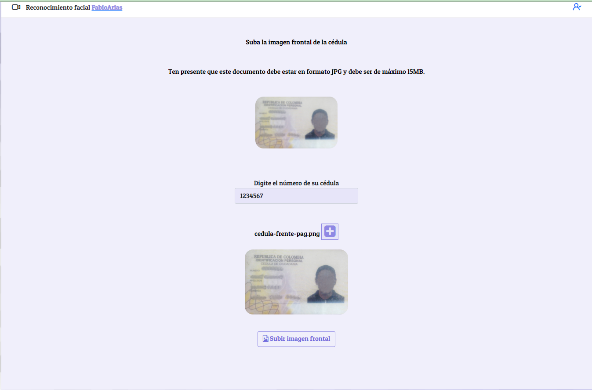

# FacesRecognition

This project was generated with [Angular CLI](https://github.com/angular/angular-cli) version 11.1.2.

## Libraries

Run the `npm install` command to install the libraries

## Desarrollo

Run `ng serve` for a dev server. Navigate to `http://localhost:4200/`. The app will automatically reload if you change any of the source files.

## Build

Run `ng build` to build the project. The build artifacts will be stored in the `dist/` directory. Use the `--prod` flag for a production build.

## Carpetas

El proyecta tiene la siguiente estructura de carpetas:

* faces-recognition
  * src
    * app
      * finalización-proceso
      * guards
      * image-document
      * recoknition
      * services
      * video-player
    * assets
    * environments

## Crear un usuario para subir imagenes

Primero debe cambiar en la carpeta environments las variables que se usaran como el usuario y el password:

```
ELOGIN: 'demo1@gmail.com',
PLOGIN: 'Demo123* 
```

Estas dos variables se usaran para:

* para realizar el registro y login de un usuario y clave
   1. en el componente **image-document** se tendrá que descomentar la función de registro `registro()` en el `ngOnInit()` para realizar el registro de un usuario.
   2. Luego de esto se envirá un codigo al correo registrado para usarlo ahora con la función `verificarEmail()` en `ngOnInit()`. Se debe cambiar el número en esta función `const verificar = {
        email:environment.ELOGIN,
        code: 123456
    }
    await this.apiService.post('confirm-code', verificar, '')`.
   3. Si se pasa el tiempo de validación del código está la función `reSendCode()` en el que se le enviará el email que se configuró. `const reSend = {
        email:environment.ELOGIN,
    }
    await this.apiService.post('resend-code', reSend, '')`.
   4. Si todo el proceso se realizó correctamente entonces se debe descomentar la función `login()`, y comentar las demás funciones en el `ngOnInit()`, para realizar el login con el usuario creado. `const body = {
    email: environment.ELOGIN,
    password: environment.PLOGIN
  }
  await this.apiService.post('login', body, '')`

**En la carpeta assets/postman se puede descargar los archivos json de postman (IKU API.postman_collection) y (IKU CUSTOM DOMAIN STAGING.postman_environment) para realizar tambien el registro de usuario y todas las validaciones con la subida de imagenes de documento de identidad**

<h1></h1> <br>
<h1></h1> <br>
<h1></h1><br>
<h1></h1>

## componentes

<h1></h1>
<h1></h1>

el componente **imagen-documento** recibe una imagen y un número de documento de identidad, tanto frontal como posterior, y se envía a un endpoint donde el usuario se agregará a la plataforma de reconocimiento facial. Tenga en cuenta que en la url debe tener el número de documenrto de identidad y enviar `add-dni-person/CC${this.numeroCedula}` los encabezados necesarios para este punto final añadirlos para que permita el envío del documento`this.headersFront = {
        type: "FRONT",
        contentType: "image/jpg",
        extension: "jpg",
        documentType: "CC"
      }`
La respuesta de este endpoint devuelve una url de un bucket para usar en el otro endpoint que enviará la imagen, de esta forma:
`this.apiService.put(res.data.uploadUrl, img, httpOptionsPut)`. con su respectivo header.
Esto se hace tanto para la imagen frontal como posterior del documento de identidad.

<h1></h1>

El componente de **recoknition** usa una librerías de tensorflow que están en la carpeta de assets/models que cuando se cargan inicia el proceso de verificación de vida. Aquí se toma la imagen del video y se inicia el proceso de reconocimiento de expresiones faciales. La función `listenerEvents` es la encargada de esta verificación.
En el componente **video-player** se usa la función `drawFace` quien esta haciendo el reconocimiento de expresiones tambien después de verificar la expresión neutral, verificará luego una expresión aleatoria y enviará una imagen de la persona que se registra a un nuevo endpoint de envío de imagen: `this.apiService.post('add-face-person/CC'+cedula, this.headersFront, httpOptions)`. Nuevamente se tiene en cuenta que en la url va el número de cédula y también los headers.

EL componente de **finalizacion-proceso** simplemente muestra la finalización de todo el proceso para luego devolverlo al inicio del mismo.

El servicio **face-api** se encarga de cargar los modelos de inteligencia artificial que se usarán, se trabaja con la librería `face-api.js`.

El servicio **video-player** se encarga de todo el proceso de reconocimiento facial usando la misma librería.
